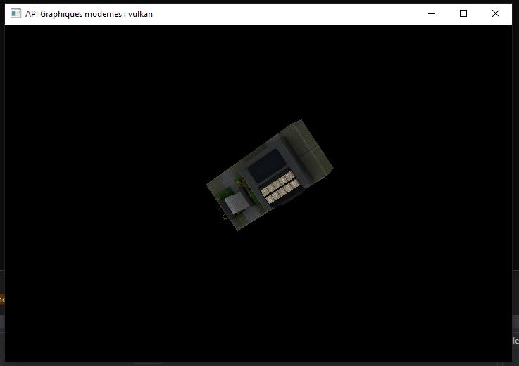

# Introduction Vulkan

Small C++ program used to learn the basics of the [Vulkan](https://www.vulkan.org/) API.

Capable of loading a .obj model and its texture to show it on the screen.

## Building

First, you must have the Vulkan SDK installed on your computer.

Then, open and generate the visual studio solution to build the .exe.

You can also rebuild the shaders using the `compileShaders.bat` script.

## Screenshots

Loading a textured obj file

